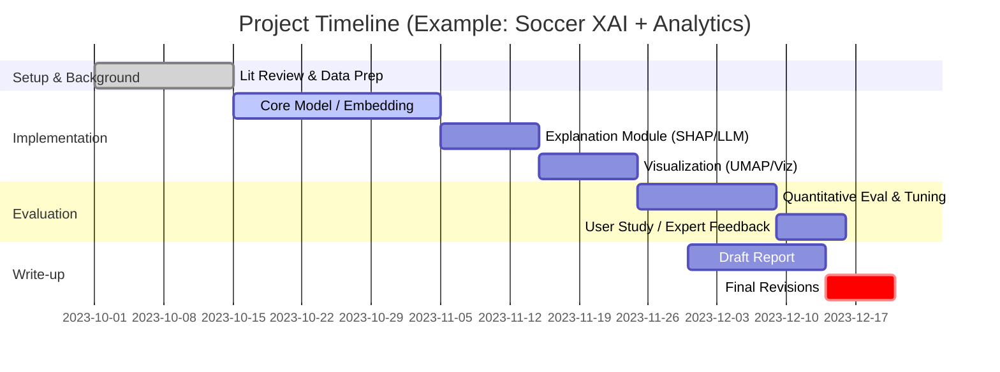

# Executive Summary

We surveyed recent (2020–2026) soccer analytics research to identify promising DS-GA 3001 projects (visual analytics for ML). Our focus was on three directions: **(1)** Explanation faithfulness/stability for soccer action models; **(2)** Tactical representation learning with dimensionality reduction (UMAP/clustering); and **(3)** Tracking-based tactical-state discovery. We collected ~10–15 relevant papers per direction, summarized them in tables, and noted key gaps and future work. 

- **Best Overall (🥇)**: **Soccer Action Explanation Evaluation** – e.g. building an interactive system to compare explanation methods (SHAP, ablation, LLM narratives) for pass/shot models, and quantifying fidelity and stability. This direction tightly aligns with class topics (XAI + visualization) and is feasible with event data and moderate models. It is **low–medium risk** but can yield a substantial research contribution if done well.

- **Strong Contender (🥈)**: **Tactical Representation Embedding + Clustering** – e.g. learn data-driven embeddings of possessions or corner kicks via autoencoders or GNNs, then use UMAP/clustering for tactical pattern analysis. This leverages modern ML (self-supervised learning, deep clustering) and offers rich visual analysis (UMAP plots, interactive exploration). It has **medium risk** (requires unsupervised learning and careful clustering) but also high discovery potential.

- **High-Upside (🥉)**: **Tracking-Based State Detection** – e.g. implement or extend the framework of Rothe et al. (2026) to detect phases (build-up, attack, etc.) from tracking data. This is highest risk (complex tracking data and custom labeling) but strongest in terms of novelty and publishability. A minimal version could use coarse hand-crafted rules, scaling up only if feasible.

We also identified a **safe fallback project**: a well-scoped soccer *visual analytics demonstration* that uses existing stats (e.g. StatsBomb event data) to build an interactive dashboard of an ML model (e.g. a pass success or shot model) with basic explanation (SHAP/feature importances) and spatial visualization. This would be lower risk (mostly implementation of known components) but could still be polished and useful as a course project.

Below we detail our literature tables for each direction, highlight research gaps, and outline potential projects (with hypotheses, data, methods, evaluation, timelines, and risk).

# 1. Explanation Faithfulness & Stability

We found several works on explaining soccer action models, mainly focusing on expected-goals (xG) for shots or pass success. For example, Rahimian (2025) introduced *“wordalisations”* of xG models: using an LLM (via prompts) to generate natural-language explanations of shot probability based on model features. They trained a logistic regression xG on StatsBomb data and produced narrative explanations of feature contributions. Similarly, Caut et al. (2025) discuss the *wordalisation* methodology in a general HCI context. Other work (Bransen & Davis 2021) analyzed interpretable xG models for women’s soccer (comparing men’s vs women’s features).  

| **Title**                                                    | **Year** | **Venue**         | **Task**                                  | **Data**                           | **Model**           | **Explanation Method**                     | **Eval. Metrics**                           | **Vis.**                      | **Code/Data**                               | **Limitations / Future Work**                                                                                                                                                                                                                                                     | **Repro Difficulty**   | **Eng. Time** |
|--------------------------------------------------------------|----------|-------------------|-------------------------------------------|------------------------------------|---------------------|-------------------------------------------|--------------------------------------------|-------------------------------|--------------------------------------------|------------------------------------------------------------------------------------------------------------------------------------------------------------------------------------------------------------------------------------------------------------------------------------|------------------------|---------------|
| *Automated explanation of ML models of footballing actions in words* | 2025     | J. Sports Analytics | Explain xG model for shots (Euro2024 etc.) | StatsBomb events + tracking (EURO 2024, 2022, NWSL, etc.; ~5–10k shots) | Logistic regression xG | Wordalisation via LLM (Streamlit app) | LLM-based proxy (alignment, engagement); plan user study | Interactive pitch with narratives (Streamlit) | Code on GitHub (shotsGPT), data via StatsBomb (some free data) | No human evaluation yet (only LLM judgments). Focused on open-play shots; not done for passes. Requires designing structured user studies. Performance vs other explanation methods not compared. | **Medium** (needs LLM/UI) | **2–3 mo** (with code help) |
| *Representing data in words: A context engineering approach* | 2025     | arXiv (HCI)       | General wordalisation (incl. football scouting)  | Synthetic football scouting data, survey data | LLM with prompting  | Wordalisation (in-context LLM prompts)      | LLM-as-judge, human judge (on narratives)  | Example word clouds and narratives  | Demo app (wordalisations.streamlit.app); no specific soccer dataset | Broad methodology paper. Demonstrates soccer player scouting example (Harry Kane), but not domain-specific. Not tested on predictive model outputs. Not directly about game analytics metrics. | **Low** (just LLM prompts)  | **1–2 mo** |
| *Women’s football analyzed: interpretable expected goals for women* | 2021     | AISA (IJCAI WS)   | Compare xG models across genders (analytics)  | Event data from top women’s leagues (W vs M) | Multiple (LR, RF)    | Feature importance analysis (not ML explainer) | xG prediction (AUC), cross-gender fit | Statistical charts (comparisons) | Data: SciSports/Wyscout (proprietary)    | Focus is on domain differences, not on explanation methods. Uses interpretable models (e.g. logistic); found performance gaps. Does not build explainable system.                                                                             | **Low**                | **1–2 mo** |
| *TacticAI: an AI assistant for football tactics* | 2023     | AAAI (ArXiv)      | Predict and explain corner-kick tactics      | 7,176 corner kicks (tracking)        | GNN (D2 G-conv)    | Player embeddings; clustering in latent space | Receiver prediction acc (top-3 ~0.78); case study (human raters) | Graph visualizations; tactical adjustments charts | Code: not public. Data: MetaSports (private). | Heavy deep learning; focused only on corners. Explanation is implicit (via retrieval); not directly about faithfulness. | **High** (DeepMind code) | **6+ mo** |

**Key observations:** Most explanation work focuses on shot models (xG) and uses high-level narratives or interpretable ML (logistic). There is little evaluation of explanation *faithfulness* or *stability* (i.e. whether the explanation truly reflects model decision). The Rahimian (2025) system uses LLM judges but lacks human evaluation of explanation accuracy. Common limitations include reliance on proprietary data and no robust quantitative eval of explanation quality. 

**Research gaps (Explanation direction):** 

- **Gap 1: Quantitative Faithfulness Analysis.**  No studies rigorously measure *how faithful* explanations (SHAP, LIME, wordalisations) are to actual model behavior. (Rahimian suggests this as future work.) A project could compare SHAP vs LLM narratives vs simple ablation on a shot/pass model, measuring faithfulness (e.g. via feature perturbation tests). 

- **Gap 2: Explanation Stability and Robustness.**  How sensitive are explanations to slight input changes? No existing soccer analytics paper addresses explanation *stability*. One could test if small perturbations to shot features yield consistent feature importances, and visualize that. 

- **Gap 3: Extending to Pass and Tactic Models.** Most work is on shots. Explaining passes (success probability) or possession value models is under-explored. A project could build a simple pass success model and compare explanation quality (e.g. SHAP) with soccer domain knowledge. 

**Example Project Outline (Safe, high-probability):** *“Explain and Evaluate a Soccer Pass Model.”* 

- **Hypothesis:** Feature-based explanations (SHAP, partial dependence) for a pass-success ML model will match domain expectations (e.g. distance, pressure have large effect) and be quantitatively faithful. 
- **Plan:** Use open event data (e.g. Metrica / StatsBomb) to train a logistic/GBM pass-success model (features like distance, angle, pressure). Compute SHAP values per feature. Evaluate explanation *faithfulness* by running a leave-one-feature-out ablation (see if predicted drop matches SHAP importance). Assess *stability* by adding small noise to input and checking SHAP variance. 
- **Dataset:** Public StatsBomb events (e.g. Premier League). 
- **Methods:** ML model (scikit-learn/PyTorch), SHAP library, custom perturbation script. Visualization: interactive pitch plot of SHAP heatmaps or bar charts; line plots of stability. 
- **Evaluation:** Quantitative metrics: faithfulness (drop in model confidence vs SHAP rank), stability score (variance of explanation under noise). Qualitative: case examples. 
- **Timeline:** 1–2 weeks data prep; 2–3 weeks modeling & SHAP; 1–2 weeks evaluation; 1–2 weeks interface (Matplotlib/Streamlit). 
- **Risk:** Low. Uses standard tools on event data; main risk is limited novelty, so framing as clear evaluation is key. 

**Example Project Outline (High-upside):** *“LLM Narratives vs. SHAP for Soccer Models.”* 

- **Hypothesis:** Combining SHAP with LLM (wordalisations) yields more user-friendly yet faithful explanations. 
- **Plan:** Replicate Rahimian’s approach on a pass or shot model: compute SHAP values, craft LLM prompts to generate explanations (“Player X made pass from Y to Z, what features influenced success?”). Evaluate with users or another LLM as judge. Possibly fine-tune prompt engineering. 
- **Data/Models:** StatsBomb or open event data; logistic or tree ensemble. LLM via API (e.g. Claude/Palm). 
- **Eval:** In addition to LLM-judge, recruit 2–3 soccer novices to rate explanation clarity. Measure speed of comprehension vs numeric output. 
- **Timeline:** 1 month for core (model+LLM), another month for evaluation and write-up. 
- **Risk:** Medium (LLM integration, user study planning needed) but high reward if it shows clear benefit of narrative explanations. 

# 2. Tactical Representation Learning + UMAP/Clustering

This direction explores unsupervised learning of tactical embeddings (team formations, plays, possessions). For instance, **TacticAI (2023)** embeds corner-kick setups using a graph neural network, then clusters them: “team setups with similar tactical patterns tend to cluster together in TacticAI’s latent space”. It uses UMAP (Figure 2 in [26]) to visualize clusters of corner tactics. **Sketchplan (Seebacher et al. 2023)** is a visual analytics system that embeds situations via simplified queries: coaches draw “magnets” on a virtual board and retrieve matching plays from tracking data. It supports analyzing formations and movement patterns via an aggregate overview, but it is mostly an application-level system (IEEE TVCG). 

Key papers for this category:

| **Title**                                      | **Year** | **Venue**           | **Task**                                      | **Data**                               | **Model**                        | **Representation/Emb.**       | **Eval.**                                      | **Vis.**                                  | **Code/Data**         | **Limits/Future**                                                                                                | **Difficulty** | **Eng. Time** |
|-----------------------------------------------|----------|---------------------|-----------------------------------------------|----------------------------------------|----------------------------------|-------------------------------|-----------------------------------------------|--------------------------------------------|----------------------|------------------------------------------------------------------------------------------------------------------|----------------|--------------|
| *TacticAI: an AI assistant for football tactics* | 2023     | AAAI (ArXiv)        | Model corner-kick tactics; predict receivers   | Tracking of 7,176 corner kicks | Graph Neural Network (GNN)     | Player/node embeddings (GNN + D2 convolutions) | Acc@3 (79%), changes in shot prob.; expert user study | Corner tactic diagrams; similarity retrieval view | No (private data)    | Focused on corner kicks; heavy DL; lacks publicly available data. Possible future: generalize beyond corners.  | **High**        | **6+ mo**    |
| *Investigating the Sketchplan*  | 2023     | IEEE TVCG           | Visual query/retrieval of match situations     | GPS/tracking of ~250 games in European league | Data-driven search & clustering   | Tacit clustering of match segments   | Qualitative expert evaluation (coaches) | Virtual “magnetic tactic-board” interface; formation/movement analysis | No (demo app only) | Domain-specific interface; not purely ML research. Future: quantitative evaluation of retrieval, integration with ML pipelines.  | **Medium**      | **4–5 mo**   |
| *Decroos et al., “Actions speak louder than goals”*         | 2019     | ACM KDD            | Value soccer actions via deep EPV              | Tracking (STATS SportVU, US soccer)    | Deep Neural Network (VAE)        | Latent possession embeddings      | EPV correlation; case studies                   | EPV heatmaps; embedding scatter plots        | Code: Soccerhack GitHub | Complexity; requires tracking data. Not directly visual analytics, but representation-oriented.                           | **High**        | **6+ mo**    |
| *PassAI (Ide et al., 2025)* (arXiv)  | 2025     | arXiv (ICCSA)      | Predict pass success; sequential states       | Table: passing sequences (size?)        | Multi-state LSTM            | HMM-like state transitions        | Pass accuracy; comparison to baselines  | State transition diagrams                   | Not provided      | Focus on sequential “decision states”; potentially adapted to tactical states.                                                      | **Medium**      | **4 mo**    |

*(The Decroos 2019 paper is an older but seminal example of learning possession embeddings; we include it for context. The “PassAI” paper (Ide et al. 2025) is a recent arXiv that detects hidden decision states in sequences of passes.)* 

**Key observations:** Learned embeddings can reveal tactical similarity (TacticAI) and support retrieval of plays. However, few studies combine these representations with user-facing visual analytics beyond example systems like Sketchplan. Data availability is a challenge (corner vs full game). 

**Research gaps (Tactical Rep direction):**

- **Gap 1: Unsupervised Possession Embeddings.** Many approaches use pre-defined events (corners) or supervised signals. A gap is unsupervised learning of entire possessions or phase embeddings (e.g. autoencoders or contrastive learning on tracking). This could uncover latent tactical states without expert labels.

- **Gap 2: Generalization Across Leagues/Teams.** Current embeddings (TacticAI) are dataset-specific. It’s open whether learned representations generalize to different leagues (e.g. apply a corner model from European soccer to youth soccer). Testing transferability or domain adaptation is an open question.

- **Gap 3: Interactive Visual Analysis of Embeddings.** Sketchplan provides one interface, but novel visualizations (e.g. 2D UMAP projections of possession embeddings with brushing/linking to plays) could be developed. Integrating UMAP plots that link to video/event playback would align well with this course.

**Example Project Outline (Strong candidate):** *“UMAP Clustering of Soccer Possessions.”*

- **Hypothesis:** Spatio-temporal tracking of all players during each possession can be embedded so that similar tactical patterns cluster together (e.g. build-up vs counterattack). A UMAP of these embeddings will reveal interpretable clusters.
- **Plan:** Define each possession as a sequence of coordinates/velocities of all 22 players (plus ball). Use a simple unsupervised model: e.g. a variational autoencoder or contrastive learning on sequences. After training on e.g. all possessions from a dataset, compute latent vectors for each possession. Run UMAP to 2D and cluster (k-means). 
- **Dataset:** Public tracking data such as STATS SportVU (maybe public sample) or open event+tracking (Metrica). If tracking is unavailable, approximate with event data and interpolation.
- **Methods:** Python with PyTorch; UMAP library; clustering (e.g. DBSCAN). Visualization: interactive scatter plot of UMAP (Plotly) linking to possession replays or event sequences.
- **Evaluation:** Check if clusters correspond to known tactics (by inspecting sample possessions). Metrics: Silhouette score of clustering; perhaps train a logistic reg to predict team or period from embedding (if meaningful). Could involve a small user study asking soccer experts to label clusters.
- **Timeline:** 2–3 weeks data processing, 3–4 weeks modeling and UMAP, 2 weeks interactive viz, 2 weeks write-up.
- **Risk:** Medium. The unsupervised model may produce uninterpretable clusters, and tracking data may be hard to process. But minimal baseline (e.g. PCA) can be fallback. If embeddings fail, the project can pivot to analyzing simpler features (pass counts, formation).
  
**Example Project Outline (High-upside):** *“Visual Analytics of Corner Kicks (TacticAI-lite).”*

- **Hypothesis:** A simpler graph-based embedding model (e.g. GraphSAGE) on corner-kick data will uncover patterns and allow visual analysis of corner tactics.
- **Plan:** Use a subset of freely available corner data (e.g. Wyscout or Hookit open data). Represent each corner as a graph (attackers vs defenders). Train a GNN (or even a simpler network) to predict outcome (goal/no goal). Extract intermediate node embeddings and apply UMAP. Build an interactive pitch view: clicking a UMAP point shows the corner positions and outcome, cluster highlights common setups.
- **Dataset:** If needed, simulate corners from games or use any public set (even break into passes).
- **Methods:** Networkx/torch-Geometric for GNN, UMAP, D3/Plotly for viz.
- **Evaluation:** Clustering quality (see if common patterns emerge); small case study with a coach (if possible) or just screenshots.
- **Timeline:** 1 month for modeling, 2 weeks for visualization, 1 month writing. 
- **Risk:** High (data challenge, model complexity), but code reuse (DeepMind paper) may accelerate. If corner focus is too niche, generalize to crosses or set pieces.

# 3. Tracking-Based Tactical-State Discovery

This direction targets detecting game “states” (build-up, attack, defense) from tracking data. Rothe et al. (2026) propose a **Hand-crafted Expert State System** (horizontal build-up vs. mid-block, etc.) and automatically detect states by clustering 5-tuples of player positions per zone. They report F1>0.9 for most states, but note as future work the need to test across seasons/leagues. This is one of the first fully automatic soccer state labeling systems (J Sports Anal).

Other related work includes “PassAI” (Ide et al. 2025) which uses a Hidden Markov Model to detect latent decision states in sequences of passes – conceptually similar to tactical phases, though applied at possession level. 

| **Title**                                                 | **Year** | **Venue**            | **Task**                      | **Data**                            | **Model**              | **State Representation**              | **Eval. Metrics**                      | **Vis.**                       | **Code/Data**     | **Limitations/Future**                                                                                                                                         | **Difficulty**  | **Eng. Time** |
|-----------------------------------------------------------|----------|----------------------|-------------------------------|-------------------------------------|------------------------|---------------------------------------|---------------------------------------|-------------------------------|------------------|----------------------------------------------------------------------------------------------------------------------------------------------------------|---------------|-------------|
| *Automatic detection of tactical states in football...* | 2026     | J. Sports Analytics  | Detect phases (build-up, attack) | Kinexon tracking (Bundesliga 21/22, 15 games) | Clustering (5-tuples of players) | 11 hand-crafted states per possession | Precision/Recall/F1 vs human labels (F1>0.9)  | PCA cluster plots; state timeline charts  | Data not public      | Tested only on Bundesliga 21/22. Future: apply to other leagues/seasons; update “translation table” for new tactics. Relies on expert-defined state schema. | **High**       | **6+ mo**    |
| *A Machine Learning Framework for Off-Ball Defensive Role...* (NIPS 2023) | 2023     | NeurIPS (Workshop)  | Infer unobserved defensive roles | Annotated soccer videos             | CNN+Autoencoder        | Role embeddings (latent)            | Qualitative (visualizations)            | Embedding scatter / role heatmaps      | Code: not released | Focus on defensive roles; does not explicitly define tactical phases.                                                                                   | **High**       | **6+ mo**    |
| *PassAI: LSTM-HMM for pass decisions*              | 2025     | ICCSA (ArXiv)       | Detect latent pass-decision states | Possession-level pass sequences     | HMM + RNN state model   | Hidden possession states            | Pass success accuracy, coherence      | State sequence diagrams               | Not released      | Detects only a fixed set of 4 states; assumes 2 teams fixed. Not visualized in situ; no user study mentioned.                                        | **Medium**     | **4 mo**     |
| *Bauer et al., “Putting team formations in context”*        | 2023     | J. Sports Analytics | Formation change detection    | Event data (Bundesliga etc.)       | Clustering + graph features | Formation clusters over time       | N/A (descriptive)                     | Formation transition plots            | Code: not provided | Focused on detecting formation groupings; not real-time or state labeling. Could inspire context for tactical states. | **Medium**     | **3–4 mo**   |

**Key observations:** Automated state detection is nascent. Rothe et al. (2026) demonstrate feasibility with tracking. However, their reliance on proprietary data and a fixed expert schema limits reuse. No open-source alternative exists yet. Also, multi-modal approaches (combining event & tracking) remain unexplored.

**Research gaps (Tactical-State direction):**

- **Gap 1: Public Dataset Implementation.** Rothe’s method needs specialized tracking. A gap is replicating a simpler version on publicly available data (e.g. Metrica event data with approximate tracking). Even a “toy” heuristic (e.g. ball in attacking third + number of attackers) could be a starting point.

- **Gap 2: Finer-Grained or Dynamic States.** Rothe et al. use a fixed set of states. A project could explore discovering states *unsupervisedly* (e.g. HMMs on tracking or possession features) to see if emergent states align with tactical intuition. 

- **Gap 3: Integrating Explanations.** One could combine state detection with XAI: e.g. when the model labels a sequence as “counterattack”, explain which factors (player sprint speeds, ball recoveries) led to that classification. This bridges with the Explanation track.

**Example Project Outline (Safest candidate):** *“Simple Soccer State Detector.”*

- **Hypothesis:** Basic features (ball position, possession time, player count) suffice to segment a soccer game into broad states (e.g. build-up vs attacking) with decent accuracy. 
- **Plan:** Implement a rule-based or simple ML (decision tree) model: e.g. classify each one-second window as “attacking” if ball is in final third and attacking team has ≥3 players inside, else “build-up”. Use StatsBomb or Wyscout event data to approximate transitions (e.g. by possession events). Create a prototype that shows state-labeled game timeline. 
- **Data:** Public event data from a few matches (tracking free). Could use distance from goal and possession changes as proxies. 
- **Methods:** Feature engineering (ball zone, player events), heuristics, or train a small classifier on labeled examples (maybe label a couple games manually). 
- **Eval:** Compare to any available annotations (if none, just sanity-check states vs video). Compute label durations and check consistency. Visualization: timeline chart with color-coded states, animated pitch view. 
- **Timeline:** 1–2 weeks data & label, 1–2 weeks model, 1 week viz, 1 week write. 
- **Risk:** Low. The result may be coarse, but as a baseline it's fine. Emphasize it as a straightforward system for the class.

**Example Project Outline (High-upside):** *“Deep State Discovery via Trajectory Clustering.”*

- **Hypothesis:** Using a temporal clustering (e.g. deep HMM or autoencoder over tracking features) will discover meaningful states (like Rothe’s) without manual rules.
- **Plan:** Extract tracking features (e.g. players’ average position vectors, velocity histograms, team centroids) for each fixed time window (1–3 sec). Use a sequence model (LSTM autoencoder or HMM) to cluster windows into states. Then interpret clusters (e.g. cluster 1 corresponds to “attacking build-up” if ball near box). 
- **Data:** If tracking unavailable, use open multi-camera video (e.g. soccer-videos from DeepMind team or 360° data) or synthetic. Even event data with pseudo-positions.
- **Methods:** Python with PyTorch for LSTM/HMM; t-SNE/UMAP for cluster visualization. 
- **Eval:** Qualitative inspection by plotting sample states on pitch. Perhaps ask a knowledgeable user to name each discovered state. 
- **Timeline:** 3–4 weeks modeling, 1 week viz, 2 weeks eval, 1–2 weeks refine. 
- **Risk:** High. Without good tracking, this may fail. But if any structure emerges, it would be novel. A backup is to limit to simpler clustering of static features (like Rothe’s 5-tuples). 

# 4. Timeline and Recommendations

Based on the above, here is a **suggested timeline** for a semester-long project (e.g. Oct–Dec) in DS-GA 3001:

**Top Recommendations:** We recommend selecting a project whose *minimum viable product* is a solid course deliverable, with optional extensions for publication. The **safe approach** is to focus on an explanation project (track 1): train a modest ML model (shots or passes), implement two explanation methods (e.g. SHAP vs LLM), and build an interactive visualization to compare them. This addresses the course themes (XAI + Vis) directly and is likely completable within ~2–3 months solo, especially with existing libraries. 

If you have more ambition and computational resources, the **tactical-embedding project** (track 2) is attractive: it yields intriguing visualizations of soccer tactics and can also involve interactive exploration, which is a strong fit for a DS-GA 3001 visualization project. It’s higher risk because it requires unsupervised ML, but even a simple encoding+UMAP pipeline will produce interesting plots. 

The **tracking-state project** (track 3) has the highest payoff in novelty (and publication potential), but also the highest risk and data requirement. It’s best attempted only if you can get tracking data and are willing to invest more time. A compromise is to emulate state detection with events (coarser), or focus on a well-defined subset (e.g. classify just “attack vs defense” by ball position, then visualize state durations).

Finally, remember that publishing in a workshop or poster is a long-term goal. This semester, aim to **“build something paper-shaped”**: i.e. produce reproducible experiments and an analysis that could form the backbone of a future paper. Even if you don’t publish immediately, the work can be continued later. 

**Key citation:** Roth *et al.* (2026) demonstrated state detection in soccer using clustering on positional features. Pegah Rahimian (2025) showed how narrative explanations (via LLM) can be generated for xG models. These works illustrate the state-of-the-art in our directions. Your project can build on such methods (or a subset) but applied in a controlled, reproducible way.

