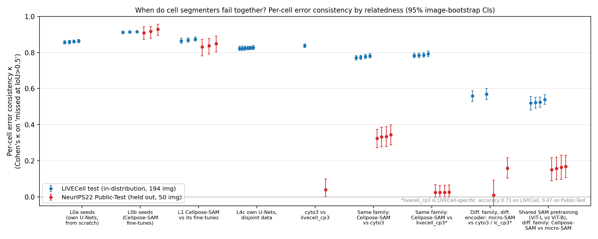
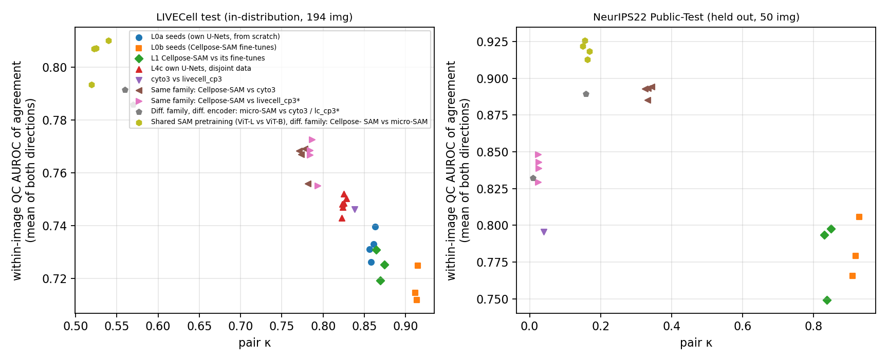

# Spike C5: pitch figures for Oct 6

## Figure 1: `fig_kappa_by_level.png`

**Caption:** Per-cell error consistency (Cohen's κ on "GT cell missed at IoU > 0.5", 95% image-bootstrap CIs) for pairs of cell segmenters, ordered by relatedness, on LIVECell (in-distribution, blue) and the held-out NeurIPS22 Public-Test (red). Seed copies fail on almost the same cells everywhere (κ ≈ 0.9). Across different models, consistency collapses out of distribution. Among the plotted cross-model pairs, the two models sharing a SAM backbone (Cellpose-SAM vs micro-SAM) are among the *least* alike, while same-family Cellpose-SAM vs cyto3 is about twice as consistent (0.33 vs 0.17 held out; 0.78 vs 0.52 in-distribution).

**Speaker notes, and what not to over-claim:**
- The Cellpose-SAM vs cyto3 > Cellpose-SAM vs micro-SAM gap is partly an **accuracy effect**: micro-SAM is less accurate, and the gap vanishes on the accuracy-matched subset (C2, K4).
- `livecell_cp3` is a LIVECell specialist (accuracy 0.47 on Public-Test), so its near-zero κ values say "it fails differently", not "it is unrelated".
- CellSAM pairs and the setting variants are omitted for clarity. They are in `work/c1/out/*/pairs.csv`.
- Two omitted pairs are *more* consistent than Cellpose-SAM vs cyto3 on Public-Test:
  - micro-SAM vs CellSAM, 0.39: both are SAM-based;
  - micro-SAM AIS vs AMG, 0.40: the same weights.

  So don't say "same family is the most consistent cross-model pair".
- Cellpose-SAM uses SAM **ViT-L**, while micro-SAM and CellSAM use **ViT-B**. Call the right-hand pair "shared SAM pretraining", not "shared encoder" (see C1).

## Figure 2: `fig_kappa_vs_auroc.png`

**Caption:** For each model pair, lower error consistency goes with better agreement-based QC. The QC measure is within-image AUROC of pairwise agreement for detecting either model's errors, averaged over both directions. This holds on LIVECell (ρ = −0.93) and more weakly on Public-Test (ρ = −0.30).

**Speaker note:**
- On Public-Test, most of the trend comes from a stronger model flagging a weaker model's errors.
- For the strongest model (Cellpose-SAM), the reference choice changes AUROC only within 0.74–0.90.
- A same-family reference (cyto3) finds the most errors in the top 5% (C2, K6).

The figures contain only aggregate statistics; no Public-Test pixels are shown (CC BY-NC-ND).
