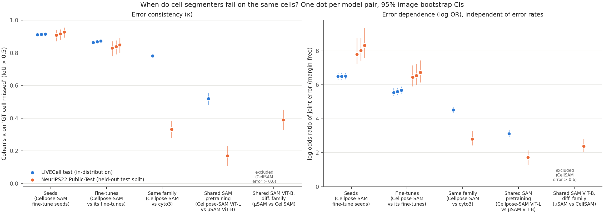
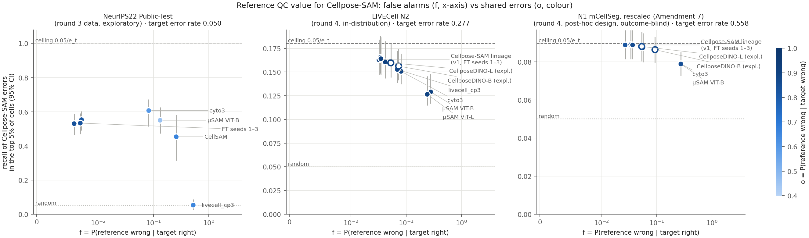

# D5: Figures for the proposal (round 4)

Both figures contain **aggregate statistics only**: no pixels or masks from any dataset, including the ND-licensed NeurIPS22 Public-Test.
- Colours are the validated reference palette. Dataset hues are blue `#2a78d6` and orange `#eb6834`, which pass the all-pairs CVD and normal-vision checks. The o-ramp is one-hue sequential blue.
- Scripts: `~/vis4ml_spikes/work/r4/r4_fig_pitch.py` and `r4_fig_tradeoff.py`.

## 1. Simplified pitch figure: `fig_kappa_by_level_v2.png`

**Caption.** Error dependence between pairs of cell segmenters, grouped by how related they are, on LIVECell test (in-distribution, blue) and NeurIPS22 Public-Test (held-out test split, orange). Left: Cohen's κ on "GT cell missed at IoU > 0.5". Right: log odds ratio of joint error, which does not depend on the two models' error rates. One dot per model pair, with 95% image-bootstrap CIs. CellSAM pairs are absent on LIVECell because CellSAM's error rate there is > 0.6 (LIVECell was held out from its training).

**Speaker notes (what the figure supports, and what it does not):**
- **Seeds and fine-tunes are near-copies on both datasets.** On the margin-free scale, seed dependence is *higher* on Public-Test (log-OR about 8) than on LIVECell (about 6.5). Errors become rarer there, but the seeds still share them.
- **The κ "collapse" of cross-model pairs on Public-Test is partly an error-rate effect.** κ drops from 0.78 to 0.33 for Cellpose-SAM vs cyto3, while log-OR drops from 4.5 to 2.8. Both fall, but less dramatically on the margin-free scale.
- **Same family (Cellpose-SAM vs cyto3) > shared SAM pretraining (Cellpose-SAM vs µSAM) holds on both of these datasets, but did not replicate on N1** (mCellSeg, D3 R2: −0.06 [−0.28, 0.15]). Do not present it as general. Present it as "holds where both models saw related training data".
- µSAM vs CellSAM (both SAM ViT-B) is the most dependent cross-family pair on Public-Test, but round 4 found no evidence that a shared encoder *checkpoint* raises dependence (D3 R3, exploratory).
- **The round-4 version of the story** is in D3 §3: the Cellpose recipe with a DINOv3 backbone instead of SAM stays nearly as dependent as a retrained copy. A good closing line for the pitch: *"what models were trained on, and how, predicts shared failures; which foundation backbone they use does not."* It is exploratory, so pitch it as a hypothesis.

## 2. Reference-QC figure: `fig_reference_tradeoff.png` (key figure candidate)

**Caption.**
- **Setup.** How well does agreement with a reference model find Cellpose-SAM's errors? For each reference:
  - x = f, the reference's false-alarm source (it is wrong where Cellpose-SAM is right);
  - y = the recall of Cellpose-SAM's errors among the 5% of cells with the lowest agreement;
  - colour = o, the share of Cellpose-SAM's errors that the reference shares.
- **Lines.** The dashed line is the ceiling 0.05 / e_t, where e_t is Cellpose-SAM's error rate; the dotted line is random.
- **Panels.**
  - NeurIPS22 Public-Test: round-3 data, exploratory.
  - LIVECell N2: fresh in-distribution images.
  - N1 mCellSeg: rescaled (Amendment 7); post-hoc design, outcome-blind.
- **Markers.** Hollow markers are exploratory models (CellposeDINO).
- **Round-3 version** with LC200: `fig_reference_tradeoff_round3.png`.

**What it shows (SYNTHESIS):**
- **When the target is good (Public-Test, e_t = 0.05), reference choice matters a lot** (recall 0.05–0.61). The best references combine moderate f with moderate o (cyto3, µSAM). A useless reference (livecell_cp3, f = 0.52) falls to random.
- **When the target is bad (N2 e_t = 0.28; N1 e_t = 0.56), every sensible reference sits at the ceiling.** At a 5% budget, almost any disagreement is a real error. This is why the confirmatory R1 on raw recall@5% came out inconclusive.
- **The threshold-free version is where {f, o} matters.** {f, o} predicts AUROC far better than κ on every dataset (D1, D3), but this figure doesn't show AUROC.
  - For the proposal, consider a **second panel row with AUROC on y**, or present the AUROC result in a table.
  - **Recommendation:** use this figure to motivate a *budget-aware* reference-choice question rather than to claim R1.
